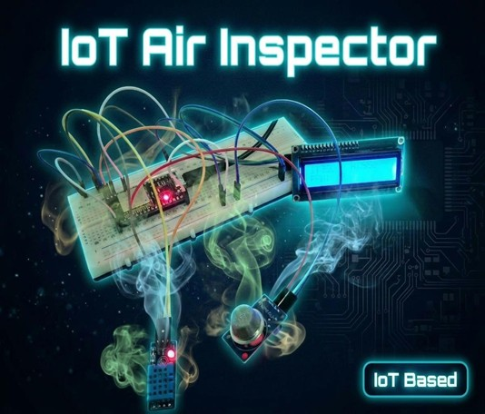

# Air Inspector

## 📌 Project Overview
This project presents an IoT-based Air Quality Monitoring System that enables real-time  detection and monitoring of environmental air conditions.
The system aims to provide a low-cost and accessible solution for increasing awareness of air 
quality and helping users take actions to protect their health.

## 🎯 Project Value

### • Real time Monitoring
Allows users to monitor air quality instantly by reading harmful gases concentration in the air.

### • Health Protection
Helps people take preventive actions when air quality becomes unsafe.

### • Remote Access
Users can check air conditions anytime and from anywhere using their smartphones.

### • Early Warning System
Alerts users when pollution levels exceed safe limits.

### • Wide Applications
Can be used in homes, schools, offices, laboratories, and industrial areas.

## 🧠 System Architecture and Components
The system uses an ESP32 microcontroller connected to a MQ135 gas sensor to measure harmful gases
,and a DHT11 sensor for the measurement of environmental humidity and temperature. The collected data is 
transmitted via Wi-Fi to the Blynk IoT platform, allowing users to monitor air quality remotely 
through their smartphones. In addition, the system includes an LCD display that locally shows 
the air quality, temperature, and humidity readings without requiring an internet connection

### System Components

#### • ESP32 Microcontroller
Acts as the brain of the system that Processes the incoming signals and Sends data to IoT platform via Wi-Fi

#### • MQ135 Gas Sensor
Measures harmful gases concentration (e.g. CO₂, smoke)

#### • DHT11 Sensor
Measures Temperature in °C and Humidity as a Percentage

#### • LCD Display
Displays real-time readings ( Gas level, Temperature, Humidity) providing instant local monitoring

#### • IoT Platform (Blynk IoT)
Enables remote monitoring

## ⏯️ Implementation
The system continuously collects environmental data (gas concentration, temperature, and humidity)
, processes it using the ESP32, and then displays the results locally on an LCD while 
simultaneously sending them to the IoT platform for remote monitoring.

## 📷 Project Gallery

### Project Poster

